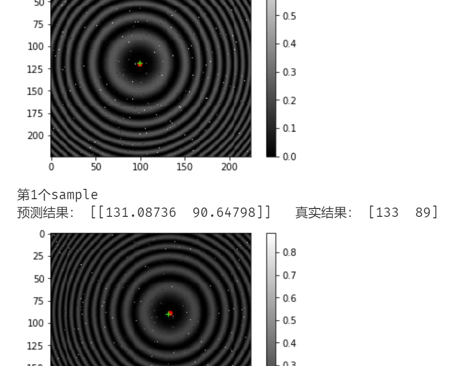

# machine_learning_newton_ring

>机器学习课程大作业“基于深度学习的条纹分析”，即用深度学习算法进行牛顿环干涉图像的中心坐标估算。  
实验平台：win10、华为云Ascend。  
主要编程工具：matlab、python、mindspore。  
目录下的tmp文件夹为自己测试用的小片段，没有实际用途。  
run.ipynb开头和结尾的几个cell是在华为云上跑的时候用的，不用管。

## 数据生成

没有实际的实验图像，因此根据牛顿环的原理和公式用matlab生成（详见[get_NTR.m](get_data/get_NTR.m)），保存在[raw_NTR_img](raw_NTR_img)，共61张。

生成的图像尺寸为$278\times278$，用python进行剪裁、添加噪声（详见[proceed_raw_img.py](get_data/proceed_raw_img.py)），变为$224\times224\times1$的灰度图，保存在[data/img](data/img)，共3050张，占54.6M。

中心坐标以numpy数组文件的形式保存为[center.npy](data/center/center.npy)，ct\[num\]即第num张图片的中心坐标。

## 算法部署与使用

基于mindspore框架。

以jupyter notebook形式使用，详见[run.ipynb](run.ipynb))。

### ver.1 2021-06-29 12:47

**已经实现的操作：**

整个run.ipynb主程序能基本跑通了，可以正确导入data中的图片和标签文件，完成基本的数据集生成、模型构建、训练、预测。

**仍然存在的问题：**

节03-2，复杂的损失函数不知道怎么设置参数，因此换了一个简单的nn.L1Loss()，优化器也是，只做了最简单的设置，能用就行。另外，学习率设置的比较大。

节04，回调函数`StepLossAccInfo()`的精度计算部分`acc = self.model.eval(self.eval_dataset, dataset_sink_mode=True)`有一些问题。之前的报错大概意思是训练过程中模型输出的结果（应当为一个二元素的一维数组，即一个预测的坐标）与计算精度用的测试集`ds_test`的标签的维度（`ds_test["label"].shape`）配合不正确。不知道怎么搞，因此我训练的时候callback里就干脆不要它了。后果是训练时候的精度和损失信息没有保存，也就没法可视化分析，不过看直接输出的loss信息大概能判断情况。

节05，`predictions`、`next()`、选图片看看的循环写错了，导致`predictions`没变，预测和真实值的编号也没对上。我的不用看了，记得重写一下。

**注：**

保存的run.ipynb不是一次运行完成的，有一些反复调试的痕迹和报错信息，请不要介意。

节00里最下面一行的运行设置可以自行修改，注释掉就能在win上面跑。但是不太建议，跑的非常慢，而且内存消耗大，我的电脑上四个小时train一个epoch。

即使是在Ascend-910上，好几个部分运行也很慢，请耐心等待。

训练出来的模型`./output_model/checkpoint/VGG-"编号".ckpt`非常大，大概有1.6G。

### ver.2 2021-06-29 20:05

认识到一个重要的问题，因为这不是分类而是回归问题，而且我的数据集里每组的图片和坐标都不同，因此不能用批量梯度下降（因为根本就不存在输出结果相同的“批”）。

因此，batch_size设为1。这样运算似乎比较慢，但结果好多了。learning_rate也改小了，降低到0.00001，得到的结果偏差已经比较小了。

### ver.3 2021-06-30 13:26

**结果：**

最后做了一些小小的改进和失败的尝试。

现在得到的模型loss在5\~30波动，训练epoch=10\~20轮的效果已经比较好了，模型可以做到误差在2像素左右。大概入下图。

**改进想法：**

改变学习率、损失函数、迭代器都没什么效果，训练出来最好的情况是学习率0.000005的时候有一次得到loss=0.5，可惜没保存。

loss波动很大，基本看不出来趋向于收敛的样子，推测欠拟合，建议增加模型复杂度。（不过那样训练就更慢了）

也可以尝试一下把一张没有噪声的图片添加不同的噪声，做成一组。这样的话就是图片噪声不同，但结果相同，可以用多张图一个batch的方法训练。
